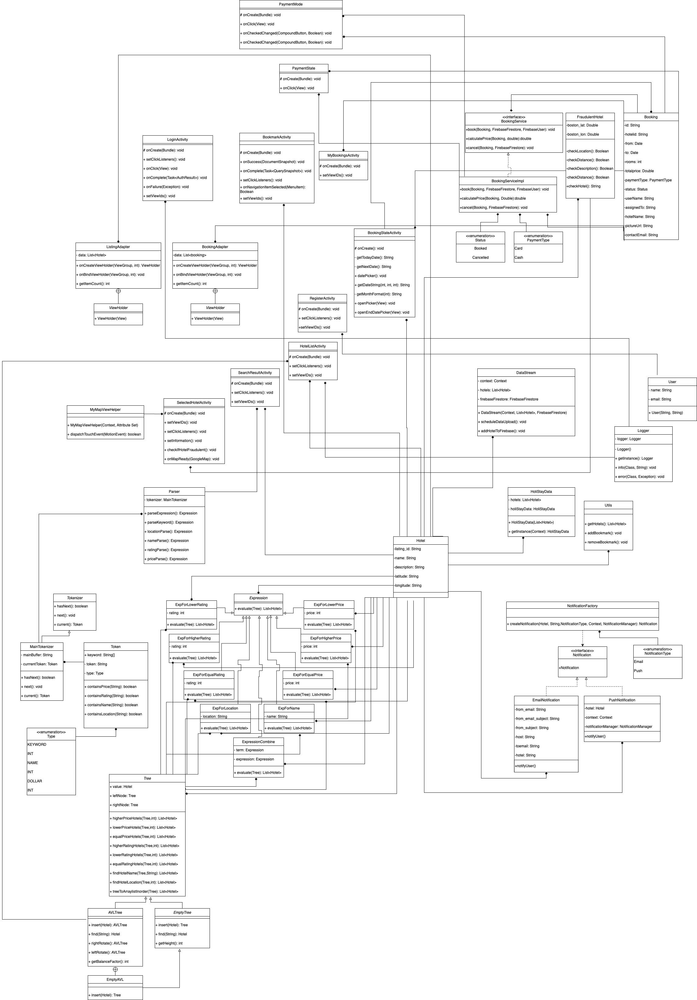

## Table of Contents

1. [Team Members and Roles](#team-members-and-roles)
2. [Conflict Resolution Protocol](#conflict-resolution-protocol)
3. [Application Description](#application-description)
4. [Application UML](#application-uml)
5. [Application Design and Decisions](#application-design-and-decisions)
6. [Summary of Known Errors and Bugs](#summary-of-known-errors-and-bugs)
7. [Testing Summary](#testing-summary)
8. [Implemented Features](#implemented-features)
9. [Team Meetings](#team-meetings)
10. [Acknowledgement](#acknowledgement)

## Team Members and Roles

| UID | Name | Role |
| :--- | :----: | ---: |
| u7433687 | Nakul Nambiar | Team Lead, Data Stream, Firebase integration, Data Fetching, Testing, Design Patterns, Database handling |
| u7370240 | Srinivasa Sai Damarla | UI Design and Development, Parser, Project Management, Data Fetching, Database handling, Documenting |
| u7173560 | Aishwarya Sonavane | Tokenizer, Parser, Data Structure, Data Fetching, Testing, Database handling, Documenting, Design Patterns |
| u7370442 | Saurabh Ghag | UI Design, Documenting, Implementation of Application Features, Database handling, UI Testing |

## Conflict Resolution Protocol

1. Conflict can be of two types. First, one can be a conflict of ideas, and then there can be conflicts in the code or the way the code is written.
2. If there is a conflict in ideas between two team members, we decided that both team members should have a discussion and try to understand the benefits of the other members' ideas. 
3. If they cannot reach a conclusion, then the ideas will be presented to the entire group, and described the merits and demerits of each idea. Then it is put to the vote among the team members to decide on the idea.
4. If there is still a tie, it is up to the team leader to decide which idea to implement.
5. In case of code conflicts and it is optimization, we as a team decided that any of the members can let the other members know if they are not following well-defined standards.

## Application Description

Holistay is an online accommodation booking platform that supports people looking for affordable renting options during their holiday vists to one of the best cities in America, Boston.

**Application Use Cases and or Examples**

Harry is looking for the least expensive and top-rated accommodation options for his two-day family holiday trip to Boston.

1) As Harry has never used the HoliStay application before, he registers as a new user to start finding the best accommodation options for his trip.
2) The search option catches his eye, and he wishes to explore cozy hotels having a price of less than $300 while having ratings greater than 80. He types in the following query in the search bar: "name=cozy$price<300$rating>80"
which shows him all the hotels satisfying his requirements. 
3) He chooses to sort the hotels in ascending order of price first, then ratings and shortlists a few hotels using the bookmark option so that he can take his time to decide the best hotel for him and his family.
4) After finalising a hotel, harry proceeds to book the accommodation by completing the booking details by providing his name, phone number, email, booking dates, and the number of rooms required.
5) Afterwhich, he chooses the payment option, i.e., cash or card. As card payment has 2% extra fees for booking he opts for cash payment.On opting for cash, his accommodation gets booked, and he receives an email notification as a confirmation on the provided email address. The email would allow him to pay for the accommodation price during his visit. Whereas, if he opts for card, he pays the amount and receives an email notification as a confirmation on the provided email address.
6) Harry can then check his booking summary from the "my booking" options available in the profile section, which can help him keep track of his bookings. Additionally, if he and his family are unable to go on the trip, they can choose to cancel the booking by visiting the same page.

*Targets Users: Those who want to find top-rated and affordable accommodations at a particular location.*

1) Users can use search options to filter out the best accommodation on price, name, location, and ratings.
2) Users can shortlist accommodations with the help of a bookmark feature.
3) Users can choose two different payment options to pay for the accommodation.
4) Users will receive booking and payment confirmation at provided email address.
5) Users can track all their accommodation bookings from my booking features available in the profile section and can cancel the booking.
6) Users can use the google map feature available on each accommodation page for navigation to the accommodation location.

## Application UML

  

## Application Design and Decisions

**Data Structures**

We used the following data structures in our project:

1. AVLTree

   * Objective: It is used for storing the Hotels from the database.

   * Locations: HotelListActivity.java , AVLTree.java

   * Reasons: Searching is better and efficient in AVL tree since it is height balanced. It is better than BST with time complexity O(log n).

2. ArrayList

   * Objective: It is used for storing Hotel details to display in the ListView. It is also used to store the list of hotels from the csv file and upload then upload it one at a time to firestore.

   * Locations: HotelListActivity.java, Utils.java, DataStream.java

   * Reasons: We need to access the item by position in order to display it in the ListView. We used to retrieve the hotels one at a time and uplaod it to firestore at regular intervals.

3. Map

   * Objective: It is used for storing Hotel Ids which are bookmarked for a particular user 

   * Locations: Utils.java 

   * Reasons: Easily fetches value according to the Key 

**Note: We are currently fetching 50 hotel listings from firebase for optimization.**

**Design Patterns**

1. Singleton Design Pattern: We used the Singleton design pattern in the Logger class. Logger class is used for logging the info and error messages so that they can be used to debug and check for errors. As only one instance of Logger is required, we created it as a Singleton Design Pattern.

2. Factory Design Pattern: We used the factory design pattern to implement the notifications. We use two types of notifications in our application. We send a notification on the app when a hotel is booked, and at the same time we also send an email to the contact user after the booking. So we created a Notification interface with a notifyuser() method. EmailNotification and PushNotification classes implemented the Notification interface.

3. Iterator Design Pattern: We used the iterator design pattern to implement the tokenizer (tokenizer is used for Searching feature). The tokenizer abstract class has methods hasNext(), next() and current(). Our MainTokenizer extends the Tokenizer and implements these methods. current() returns the current Token, next() iterates over the mainBuffer to go to the next Token while hasNext() checks if the there is still a Token remaining in the mainBuffer.

**Grammar(s)**

Production Rules:
    
    <expression> ::= <term> | <term> $ <expression>
    <term> ::= <keyword> <comparison> <value>
    <value> ::= <integer> | <string>
    <comparison> ::= "<" | ">" | "="
 
User can put the search query in the search bar present and search for hotels according to their name, location, price and rating . As you click on the search button the hotel list will appear according to search query. If you want to view specific hotel information you can click on the particular hotel card.

Search query : 

While searching the structure should be keyword (name, price , rating , location) then operator(=,<,>) and value(integer for price,rating and string for name,location). For multiple search queries a $(Dollar sign) should be put in between the queries. 

Examples :

1. name=cozy 
   Query will return hotels with hotel name containing "cozy"
2. rating>90
   Query will return hotels with rating more than 90.
3. price>200
   Query will return hotels with price more than 200$.
4. location=roslindale
   Query will return hotels which are present in the neighbourhood roslindale.
5. name=pretty$rating>70$price>100
   Query will return hotels with name containing pretty and rating higher than 70 and price higher than 100$.      

**Tokenizer and Parser**

Tokenizer and Parser is used for Searching feature . Our MainTokenizer has functions : current() returns the current Token, next() iterates over the mainBuffer to go to the next Token while hasNext() checks if the there is still a Token remaining in the mainBuffer. 
MainTokenizer returns currentToken in the format of(Token value , Token Type). Token Type and Token value can be DOLLAR, "$ or COMPARISION , "=","<",">" or KEYWORD,"name","price","rating","location" or NAME, "cozy" or INT ,"12". 

Parser is used for parsing the given search query input and return an Expression according to the query parsed. Parser can parse the expression according to the keyword and depending on the keyword it can furthur parse with the functions such as priceParse() , ratingParse() , locationParse() ,nameParse() and return the given expression. We can evaluate this expression to get the desired list of Hotels.

**Surprise Item**

   * Implementing the surprise item was very interesting.
   * Firstly, we had to consider different fraudulent cases that could occur while making hotel reservations. 
   * Then we had to find use cases for how to detect fraudulent activity.
   * With the dataset we selected, we decided to detect the fraudulent hotel listings on the application and let the users know by displaying a simple pop notification. Then it is up to the user if they want to proceed to book the mentioned hotel.
   * With our experience with other marketplace applications, we decided on the following validations to check if the listing is a fraud:
      - if the latitude and longitude details are provided for the hotel.
      - if the provided location is within 75kms of central Boston. 
      - if the host of the listing is verified.
      - if there is enough description for the provided listing.
   * If the listing falls under more than one of the above conditions, we consider it fraudulent and then display a simple nudge to inform the user about fraud suspicion.
   * The concepts we learned during the course like reusable functions, avoiding nesting of functions and writing easy-to-read functions, helped us develop the functions to detect the fradulent listings.

## Summary of Known Errors and Bugs

1. *Bookmark Icon*
- Sometimes the bookamrk icon on the hotel card might be ticked even when the hotel is not bookmarked. After debugging, we have confirmed that this is not an issue of data persistence but an issue caused while displaying the cards in the adapter.
- It will give a wrong persecption to the user about the number of bookamarked hotels. But you can see the correct bookmarks in the bookmarks activity by clicking on 'Boomarks' in the bottom navigation menu.

2. *Push Notification*
- The push notification does not work on all the devices.

3. *Sign Out*
- Going back after signing-out of the application and performing any action will crash the application.

4. *UI Testing Bug*
- Adding a few dependencies in the test class and commenting on a few lines from the code passes all test cases But it causes some abnormality in the application i.e. after the booking confirmation app crashes. So we have commented on test cases.

## Testing Summary

Number of test cases: 36   
Code coverage according to Packages :   
DataStructures : 100% classes covered   
HotelDetails : 50% classes covered   
Parser , Tokenizer : 100% classes covered   
verification : 100% classes covered   
Types of tests created: Junit test cases   

| Test Class |                    Classes Covered|
|:-------|----------------------------------:|
|   AVLTreeTest  |   AVLTree , Tree , EmptyTree  |
|    BookingTest  |    Booking , BookingServiceImpl |
|  HotelVerificationTest     |       Hotel , FraudulentHotel |
|     ParserTest |      Classes in Parser Package|
|     TokenizerTest  |  MainTokenizer , Token|

  

## Implemented Features

Feature Category: Search-related features  
*Implemented features:*
1. **Sort a list of products returned from a search based on price, popularity, rating, availability, etc. (easy)**
   * Class SearchResultActivity: method setClickListener(), Lines of code: 83-163
   * Description: Sort search result in ascending or descending order, according to either price or rating.
 

Feature Category: Greater Data Usage, Handling and Sophistication  
*Implemented features:*  
1. **Use GPS information (easy)**
   * Class MyMapViewHelper: whole file
   * Class SelectedHotelActivity: method onMapReady(), lines 67-68
   * Description: Display the hotel location using google maps while having the functionality of zooming and scrolling irrespective of the layout used.

Feature Category: User Interactivity  
*Implemented features:*  
1. **The ability to micro-interact with items in your app (e.g. add to watchlist/add to cart/like an
item/report an item/add reviews (stars)) (easy)**
   * Class Utils: addBookmark() lines: 40-61 , removeBookmark() lines: 63-81
   * Class ListingAdapter: lines 74-85
   * Class BookmarkActivity: whole file
   * Description: Allow user to bookmark hotels or remove the bookmark. Additionally, he can view his bookmarked hotels in a separate tab.

Feature Category: Creating Processes  
*Implemented features:*  
1. **Payment process (fake process, do not connect to any payment provider). The user must choose between at least two different payment methods (e.g., credit card, cash, bitcoin). The payment method may add extra costs (e.g., credit card adds 1.5% to the total value). (easy)**
   * Class PaymentMode: whole file
   * Class PaymentState: whole file
   * Class BookingServiceImpl: whole file
   * Description: We have allowed the user to choose between two methods of payment, cash or card. If the user chooses to pay by card, they have to pay 2% to the total value. If the user chooses to pay by cash, their booking gets confirmed.

Feature Category: Firebase Integration  
*Implemented features:*  
1. **Use Firebase to implement user Authentication/Authorisation.(easy)**
   * Class LoginActivity: onClick() lines 58-76
   * RegisterActivity: onClick() lines 79-106
   * ProfileActivity: onClick() lines 107-114   
   

2. **Use Firebase to persist all data used in your app. (medium)**
   * Class DataStream: whole file
   * Class Utils: addBookmark() lines: 40-61 , removeBookmark() lines: 63-81 
   * Class RegisterActivity: lines 85-95
   * Class BookingServiceImpl: book() lines 29-44, cancel() lines 56-69

Feature Category: Special Feature  
*Implemented features:*  
1. **Detect fraudulent behaviours/ scams to increase protection**
   * Class FraudulentHotel: whole file
   * Class SelectedHotelActivity: methods checkIfHotelFraudulent() lines 148-152
   * Description: If the hotel details seem to be fradulent using the cases we have written to check the description, location and if the host is verified or not, we send an alert as soon as he selects such a hotel listing.

## Team Meetings

- *[Team Meeting 1](./meeting1.md)*
- *[Team Meeting 2](./meeting2.md)*
- *[Team Meeting 3](./meeting3.md)*
- *[Team Meeting 4](./meeting4.md)*
- *[Team Meeting 5](./meeting5.md)*
- *[Team Meeting 6](./meeting6.md)*

## Acknowledgement
This android application was created as part of the Software Construction course (COMP2100/6442) at the Australian National University convened by Dr. Bernardo Pereira Nunes.

